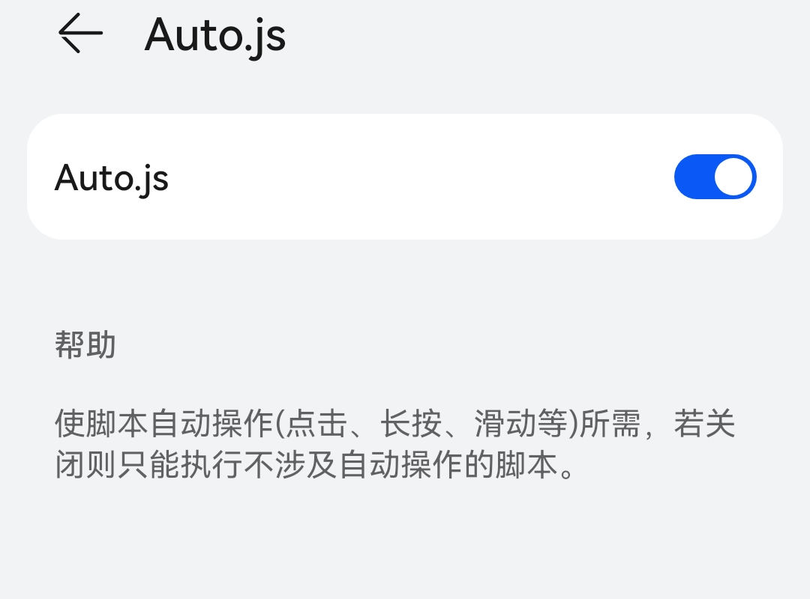
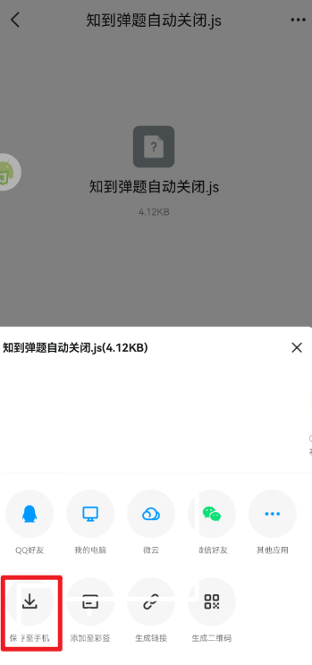
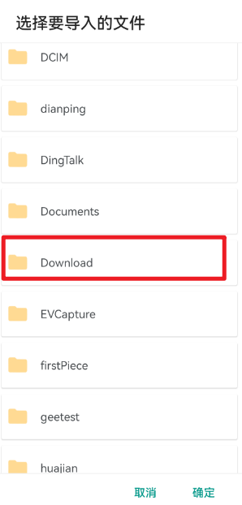
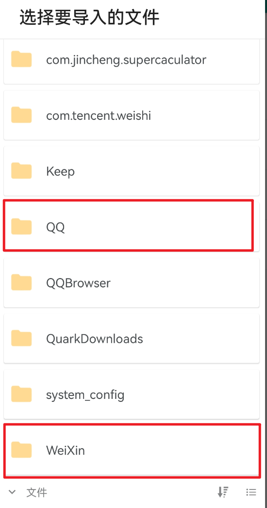
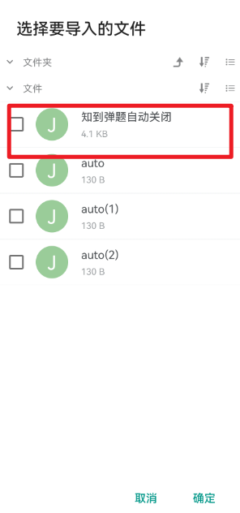
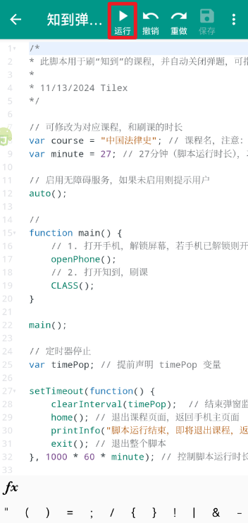
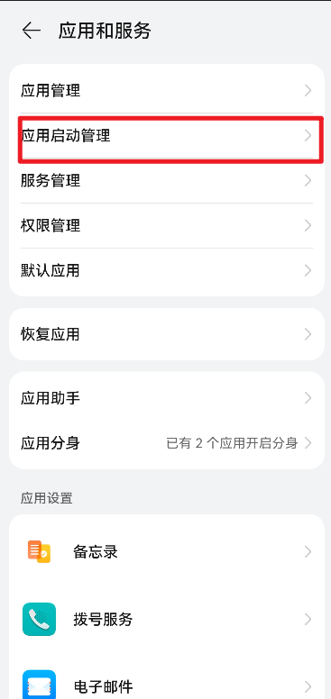
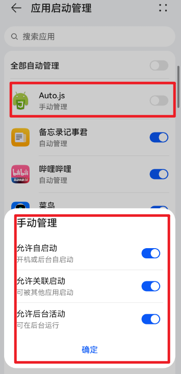

# 知到弹题自动关闭

## 效果演示

## 使用说明

1. 安装软件：auto.js

   脚本是在 auto.js 软件上运行；安装包已放在文件夹内

2. 打开权限
auto.js 运行

3. 导入脚本

   以 QQ 保存脚本文件为例
   

       
   

   进入软件：auto.js，点击右下角+号，可导入文件

   

       
   

   找到 Download

   

      
   

   进入后找到 QQ（或者微信）就可以看到对应的脚步文件了

   

       
   

   

       
   

   4. 运行脚本

   

       
   

## Q&A 常见问题

1. 手机系统不支持软件 auto.js
   可以查看[github 文档](https://github.com/kkevsekk1/AutoX?tab=readme-ov-file)，或者下载安卓模拟器

2. 知到需完成登录

3. 定时任务添加：找到脚本，点击最右侧

  

      
  

如果定时任务没有运行，可能 auto.js 权限没有打开（解决方法一：你打开 auto.js 软件，挂载后台运行）
打开权限：（确保已打开无障碍权限）

  

      
  

  

      
  

​

​

​

​

​
